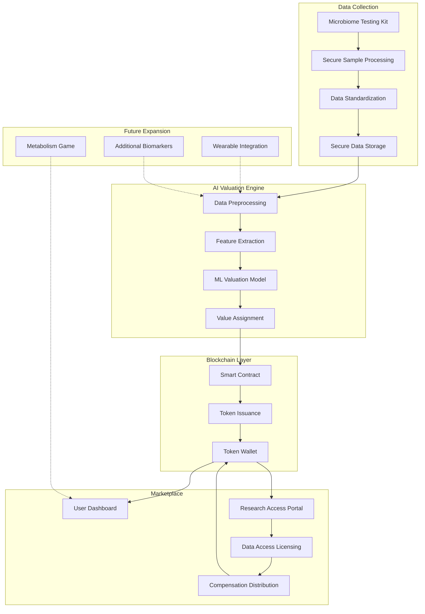

# BioCoin - Decentralized Biological Data Marketplace

<div align="center">
  

  [](https://opensource.org/licenses/MIT)
  [](https://biocoin.vip)
  [](https://x.com/BioCoindotvip)
  [](https://github.com/BioCoinLab/BioCoin)
</div>

## 📊 Executive Summary

BioCoin represents a paradigm shift in how individuals monetize and control their biological data, starting with the microbiome. As the world's first decentralized marketplace for biological data, BioCoin enables users to tokenize their microbiome information through advanced AI valuation, maintain complete sovereignty over their data, and receive fair compensation when researchers access it. Built on the Solana blockchain for high-performance and low transaction costs, BioCoin creates a revolutionary "Somatic Sovereignty Mesh" that unlocks the value of previously underutilized personal biological assets.

## 🌟 Core Value Proposition

BioCoin addresses several critical market needs:

1. **Data Ownership & Monetization**: Individuals can maintain complete control of their biological data while earning tokens when it's accessed for research.

2. **Research Acceleration**: The platform creates direct connections between data providers and researchers, eliminating intermediaries and accelerating scientific progress.

3. **Fair Value Distribution**: Unlike traditional models where companies capture most value from biological data, BioCoin ensures providers receive the majority (70%) of access fees.

4. **Biological Asset Tokenization**: Creating a new asset class from previously untradeable biological information, with AI-driven valuation providing objective pricing.

5. **Personalized Health Insights**: Beyond financial benefits, users gain valuable knowledge about their own microbiome and health correlations.

## 🔧 Technical Architecture

BioCoin employs a four-layer architecture designed for security, scalability, and user sovereignty:



### 1. Data Collection & Processing Layer

- **API Integration Hub**:
  - RESTful APIs for connecting to microbiome testing providers
  - OAuth 2.0 authentication for secure provider account linkage
  - Webhook endpoints for receiving test completion notifications
  - Batch import APIs for historical data retrieval

- **Data Standardization Pipeline**:
  - Taxonomic classification harmonization across testing methodologies
  - Reference database mapping (NCBI taxonomy, GTDB, etc.)
  - Metadata standardization for consistent feature extraction
  - Quality control filters for contamination and sequencing errors

- **Privacy Engine**:
  - Data pseudonymization protocols
  - Multi-level encryption for data at rest and in transit
  - Consent management system with granular permission controls
  - Zero-knowledge proof implementations for certain verifications

- **Storage Infrastructure**:
  - HIPAA-compliant encrypted data vaults
  - Distributed storage with geographical redundancy
  - Cold storage for long-term data preservation
  - Caching layer for frequently accessed reference data

### 2. AI Analysis & Valuation Layer

- **Feature Extraction Engine**:
  - Taxonomic profile vectorization
  - Metabolic pathway completion analysis
  - Diversity metrics calculation (Shannon, Simpson, Faith's PD)
  - Strain-level variant detection

- **Valuation Neural Networks**:
  - Multi-factor valuation model architecture
  - Deep learning networks for pattern recognition
  - Transfer learning from reference population datasets
  - Reinforcement learning for market-responsive adjustments

- **Insight Generation System**:
  - Health correlation inference engine
  - Personalized recommendation generator
  - Longitudinal trend analysis
  - Comparative population analytics

- **Adaptive Simulation Environment**:
  - Virtual substrate utilization testing framework
  - Competitive microbial community modeling
  - Metabolic network simulation engine
  - Bacterial strain interaction prediction system

- **Machine Learning Pipeline**:
  - Data preprocessing and normalization modules
  - Feature importance ranking system
  - Model training and validation workflow
  - A/B testing framework for model improvements

### 3. Blockchain & Smart Contract Layer

- **Token Contract**:
  - SPL token standard implementation on Solana
  - Token distribution and vesting mechanics
  - Deflationary mechanisms (partial burn on transactions)
  - Staking reward distribution system

- **Data Access Control**:
  - Permission management programs
  - Time-bound access grant mechanisms
  - Purpose-limited authorization system
  - Immutable access logs and audit trails

- **Reward Distribution**:
  - Automated compensation for data access
  - Multi-party payment splitting mechanisms
  - Fee calculation based on access type and duration
  - Research initiative bonus distribution

- **Governance System**:
  - Proposal submission and tracking mechanism
  - Token-weighted voting implementation
  - Automatic execution of approved changes
  - Community treasury management

### 4. Application & Interface Layer

- **User Dashboard**:
  - Progressive web application (PWA)
  - Mobile-responsive interface
  - Real-time data visualization components
  - Personal health insights presentation

- **Researcher Portal**:
  - Advanced query builder interface
  - Cohort selection and management tools
  - Data access request workflow
  - Result visualization and export tools

- **Mobile Applications**:
  - Native iOS and Android applications
  - Biometric authentication
  - Push notifications for research opportunities
  - Simplified data connection flow

## 🔐 Security Architecture

BioCoin implements industry-leading security measures to protect sensitive biological data:

- Multi-layer encryption (AES-256, RSA)
- Zero trust network architecture
- Regular penetration testing schedule
- Bug bounty program
- Independent security audits
- Comprehensive access logging
- Multi-factor authentication
- Role-based access control

## 🤝 Integration Partners

BioCoin's ecosystem is strengthened through strategic partnerships:

- **Testing Partners**: Viome, BiomeSight, Thryve, uBiome
- **Research Organizations**: Knight Lab, The Microsetta Initiative, Human Microbiome Project
- **Blockchain Infrastructure**: Solana validators and RPC providers
- **Data Security**: Third-party encryption and security auditors

## 🛣️ Development Roadmap

| Phase | Milestones |
|-------|------------|
| **Phase 1: Foundation** | • Core data standardization pipeline<br>• Initial AI valuation model<br>• Token contract development<br>• Basic user interface |
| **Phase 2: Platform Launch** | • Production deployment<br>• Initial research marketplace<br>• Token generation event<br>• Web application release |
| **Phase 3: Expansion** | • Additional biological data types<br>• Advanced health insights<br>• Research tools expansion<br>• Mobile application launch |
| **Phase 4: Ecosystem Growth** | • Developer API availability<br>• Cross-chain functionality<br>• International expansion<br>• Advanced collaboration tools |

## 💻 Technical Stack

BioCoin leverages a modern technology stack for optimal performance and security:

### Frontend
- **Framework**: React.js with Next.js
- **State Management**: Redux with Redux Toolkit
- **UI Components**: TailwindCSS for styling
- **Data Visualization**: D3.js and recharts
- **Wallet Integration**: Solana Wallet Adapter

### Backend
- **Runtime**: Node.js with Express.js
- **API Gateway**: GraphQL
- **Caching**: Redis
- **Database**: PostgreSQL (relational) and MongoDB (document)
- **Message Queue**: RabbitMQ

### Blockchain
- **Network**: Solana
- **Smart Contracts**: Rust
- **Token Standard**: SPL Token
- **Testing Framework**: Jest and Mocha

## 📂 Project Structure

```
BioCoin/
├── frontend/           # React-based web application
├── backend/            # Node.js API server
├── contracts/          # Solana smart contracts
├── scripts/            # Utility scripts
├── docs/               # Documentation
├── assets/             # Static assets
└── shared/             # Shared code and utilities
```

## 🚀 Getting Started

### Prerequisites

- Node.js (v16+)
- npm or yarn
- Solana CLI tools
- Docker and Docker Compose (optional)

### Installation

1. Clone the repository:
   ```
   git clone https://github.com/BioCoinLab/BioCoin.git
   cd BioCoin
   ```

2. Install dependencies:
   ```
   # Install frontend dependencies
   cd frontend
   npm install
   
   # Install backend dependencies
   cd ../backend
   npm install
   ```

3. Set up environment variables:
   ```
   cp .env.example .env
   ```

4. Start the development servers:
   ```
   # Start backend server
   cd backend
   npm run dev
   
   # Start frontend server (in a new terminal)
   cd frontend
   npm start
   ```

## 📄 License

This project is licensed under the MIT License - see the LICENSE file for details.

## 📧 Contact

For questions or support, please open an issue on our [GitHub repository](https://github.com/BioCoinLab/BioCoin/issues). 